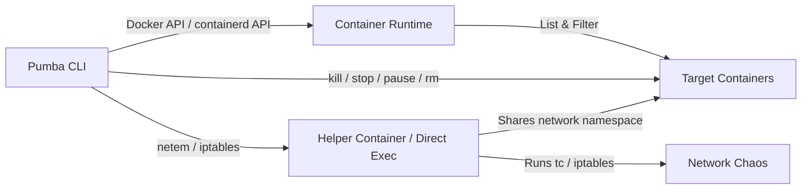

<p align="center">
  
  <br>
  <strong>Chaos testing tool for Docker and containerd</strong>
</p>

<p align="center">
  <a href="https://github.com/alexei-led/pumba/releases"></a>
  <a href="https://github.com/alexei-led/pumba/actions/workflows/release.yaml"></a>
  <a href="https://github.com/alexei-led/pumba/actions/workflows/build.yaml"></a>
  <a href="https://goreportcard.com/report/github.com/alexei-led/pumba"></a>
  <a href="https://codecov.io/gh/alexei-led/pumba"></a>
  <a href="https://github.com/alexei-led/pumba/blob/master/LICENSE"></a>
</p>

<p align="center">
  <a href="#quick-start">Quick Start</a> ·
  <a href="docs/guide.md">User Guide</a> ·
  <a href="docs/network-chaos.md">Network Chaos</a> ·
  <a href="docs/deployment.md">Deployment</a> ·
  <a href="CONTRIBUTING.md">Contributing</a>
</p>

---

Pumba is a chaos testing and network emulation tool for Docker and containerd containers. Inspired by [Netflix Chaos Monkey](https://netflix.github.io/chaosmonkey/), Pumba brings chaos engineering to the container level — kill, stop, pause, and remove containers, inject network delays and packet loss, or stress-test container resources.

## How It Works



Pumba supports two container runtimes:
- **Docker** (default): Uses the Docker API. For network chaos, creates a helper container sharing the target's network namespace.
- **containerd**: Uses the containerd API directly. For network chaos, executes `tc`/`iptables` commands directly inside the target container (requires tools to be installed in the container image).

## Features

| Category            | Commands                                  | Description                                                                   |
| ------------------- | ----------------------------------------- | ----------------------------------------------------------------------------- |
| **Container Chaos** | `kill`, `stop`, `pause`, `rm`, `restart`  | Disrupt container lifecycle                                                   |
| **Execute**         | `exec`                                    | Run commands inside containers                                                |
| **Network Delay**   | `netem delay`                             | Add latency to egress traffic                                                 |
| **Packet Loss**     | `netem loss`, `iptables loss`             | Drop packets (egress and ingress)                                             |
| **Network Effects** | `netem duplicate`, `corrupt`, `rate`      | Duplicate, corrupt, or rate-limit packets                                     |
| **Stress Testing**  | `stress`                                  | CPU, memory, I/O stress via stress-ng (child cgroup or same-cgroup injection) |
| **Targeting**       | names, regex (`re2:`), labels, `--random` | Flexible container selection                                                  |
| **Scheduling**      | `--interval`                              | Recurring chaos at fixed intervals                                            |

## Quick Start

### Install

Download the [latest release](https://github.com/alexei-led/pumba/releases) for your platform, or use Docker:

```bash
# Binary
curl -sL https://github.com/alexei-led/pumba/releases/latest/download/pumba_linux_amd64 -o pumba
chmod +x pumba

# Docker (recommended)
docker pull ghcr.io/alexei-led/pumba:latest
```

### First Chaos

```bash
# Kill a random container matching "test" every 30 seconds
pumba --interval=30s --random kill "re2:^test"

# Add 3 seconds network delay to mydb for 5 minutes
pumba netem --duration 5m delay --time 3000 mydb

# Drop 10% of incoming packets to myapp for 2 minutes
pumba iptables --duration 2m loss --probability 0.1 myapp

# Stress CPU of mycontainer for 60 seconds
pumba stress --duration 60s --stressors="--cpu 4 --timeout 60s" mycontainer
```

### Containerd Runtime

```bash
# Kill a container by ID via containerd
pumba --runtime containerd --containerd-namespace k8s.io kill <container-id>

# Add network delay via containerd (requires tc in the container image)
pumba --runtime containerd --containerd-namespace moby \
  netem --duration 5m delay --time 3000 <container-id>
```

| Flag | Default | Description |
|------|---------|-------------|
| `--runtime` | `docker` | Container runtime (`docker` or `containerd`) |
| `--containerd-socket` | `/run/containerd/containerd.sock` | containerd socket path |
| `--containerd-namespace` | `k8s.io` | containerd namespace (`k8s.io` for Kubernetes, `moby` for Docker) |

### Run with Docker

```bash
docker run -it --rm \
  -v /var/run/docker.sock:/var/run/docker.sock \
  ghcr.io/alexei-led/pumba --interval=10s --random kill "re2:^test"
```

## Docker Images

| Registry                      | Image                      | Status        |
| ----------------------------- | -------------------------- | ------------- |
| **GitHub Container Registry** | `ghcr.io/alexei-led/pumba` | ✅ Primary    |
| Docker Hub                    | `alexeiled/pumba`          | ⚠️ Deprecated |

Images are built natively for **linux/amd64** and **linux/arm64** (no QEMU).

## Documentation

| Document                                     | Description                                                    |
| -------------------------------------------- | -------------------------------------------------------------- |
| **[User Guide](docs/guide.md)**              | Container chaos commands, targeting, scheduling, configuration |
| **[Network Chaos](docs/network-chaos.md)**   | netem, iptables, advanced scenarios, architecture diagrams     |
| **[Stress Testing](docs/stress-testing.md)** | CPU/memory/IO stress testing with stress-ng                    |
| **[Deployment](docs/deployment.md)**         | Docker, Kubernetes DaemonSets, OpenShift                       |
| **[Contributing](CONTRIBUTING.md)**          | Build from source, run tests, project structure                |

## Demo

[](https://asciinema.org/a/82428)

## Community & Support

- **Issues**: [GitHub Issues](https://github.com/alexei-led/pumba/issues)
- **Blog**: [Pumba - Chaos Testing for Docker](https://medium.com/p/pumba-chaos-testing-for-docker-d55c91aee013)

## License

[Apache License 2.0](LICENSE)
