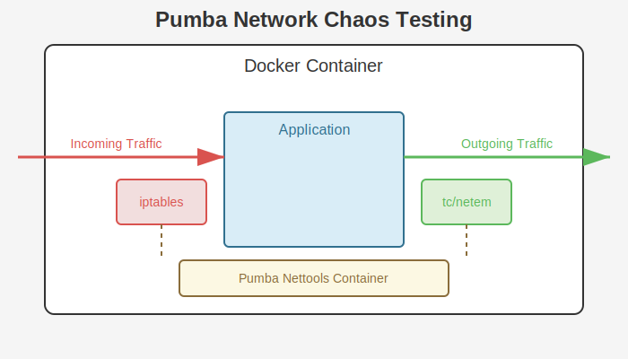

# Advanced Network Chaos Testing with Pumba

This guide provides detailed instructions for creating advanced network chaos testing scenarios using Pumba's combined network tools.

## Overview

Pumba now offers support for both outgoing traffic manipulation (using `tc` with `netem`) and incoming traffic manipulation (using
`iptables`). By combining these tools, you can create more realistic and complex network chaos scenarios.

**Runtime Note**: Pumba supports both Docker and containerd runtimes. The examples in this guide are applicable to both. Remember to use the global `--runtime` flag (e.g., `--runtime containerd`) and provide necessary runtime-specific options (like `--containerd-address` and `--containerd-namespace` for containerd) when running these commands. If `--runtime` is not specified, Pumba defaults to the Docker runtime.

Example using containerd:
```bash
# Add 200ms delay to a container started with containerd
ctr -n demo run -d --name web docker.io/library/nginx:alpine
pumba --runtime containerd \
  --containerd-address /run/containerd/containerd.sock \
  --containerd-namespace demo \
  netem --duration 30s delay --time 200 web
```



The diagram above illustrates how Pumba uses a single nettools container to manipulate both incoming traffic (via iptables) and outgoing
traffic (via tc/netem) for the target application container.

## Nettools Images

Pumba uses multi-architecture container images that include both `tc` and `iptables` tools:

- `ghcr.io/alexei-led/pumba-alpine-nettools:latest` - Alpine-based (smaller size)
- `ghcr.io/alexei-led/pumba-debian-nettools:latest` - Debian-based (better compatibility)

Both images support:

- amd64 (x86_64) architecture
- arm64 (aarch64) architecture

## Common Chaos Testing Scenarios

### 1. Asymmetric Network Conditions

In real networks, upload and download characteristics often differ. You can simulate this with Pumba:

```bash
# Slow uploads: Add 500ms delay to outgoing traffic
pumba netem --tc-image ghcr.io/alexei-led/pumba-alpine-nettools:latest \
  --duration 5m \
  delay --time 500 --jitter 50 \
  myapp &

# Unreliable downloads: Add 10% packet loss to incoming traffic
pumba iptables --iptables-image ghcr.io/alexei-led/pumba-alpine-nettools:latest \
  --duration 5m \
  loss --probability 0.1 \
  myapp &
```

### 2. Low Bandwidth with Packet Loss

Test how your application handles both bandwidth limitations and occasional packet loss:

```bash
# Limit bandwidth to 1Mbit/s
pumba netem --tc-image ghcr.io/alexei-led/pumba-alpine-nettools:latest \
  --duration 10m \
  rate --rate 1mbit \
  myapp &

# Add 5% packet loss to incoming traffic
pumba iptables --iptables-image ghcr.io/alexei-led/pumba-alpine-nettools:latest \
  --duration 10m \
  loss --probability 0.05 \
  myapp &
```

### 3. Protocol-Specific Degradation

You can target specific protocols for different types of network chaos:

```bash
# Add latency to all outgoing HTTP traffic
pumba netem --tc-image ghcr.io/alexei-led/pumba-alpine-nettools:latest \
  --duration 15m \
  delay --time 200 \
  myapp &

# Drop 20% of incoming UDP packets only
pumba iptables --iptables-image ghcr.io/alexei-led/pumba-alpine-nettools:latest \
  --duration 15m \
  --protocol udp \
  loss --probability 0.2 \
  myapp &
```

### 4. Microservices Communication Testing

Test how your microservices handle degraded network conditions between specific services:

```bash
# Add high latency between Service A and Service B
pumba netem --tc-image ghcr.io/alexei-led/pumba-alpine-nettools:latest \
  --target service-b-ip \
  --duration 10m \
  delay --time 1000 --jitter 200 \
  service-a &

# Add packet loss from Service B to Service C
pumba iptables --iptables-image ghcr.io/alexei-led/pumba-alpine-nettools:latest \
  --source service-c-ip \
  --duration 10m \
  loss --probability 0.15 \
  service-b &
```

### 5. Port-Specific Degradation

You can target specific ports to simulate more targeted network issues:

```bash
# Add packet corruption to outgoing database traffic (port 5432)
pumba netem --tc-image ghcr.io/alexei-led/pumba-alpine-nettools:latest \
  --target db-server-ip \
  --duration 5m \
  corrupt --percent 5 \
  myapp &

# Add packet loss to incoming HTTP traffic (port 80)
pumba iptables --iptables-image ghcr.io/alexei-led/pumba-alpine-nettools:latest \
  --dst-port 80 \
  --duration 5m \
  loss --probability 0.1 \
  myapp &
```

## Kubernetes Integration

When running in Kubernetes, you can use Pumba to test pod-to-pod communication resilience:

```yaml
# Example DaemonSet section that combines netem and iptables
spec:
  template:
    spec:
      containers:
        - name: pumba-netem
          image: gaiaadm/pumba:latest
          args:
            - --random
            - --interval=30s
            - netem
            - --tc-image=ghcr.io/alexei-led/pumba-alpine-nettools:latest
            - --duration=5m
            - delay
            - --time=500
            - "re2:app-.*"
        - name: pumba-iptables
          image: gaiaadm/pumba:latest
          args:
            - --random
            - --interval=30s
            - iptables
            - --iptables-image=ghcr.io/alexei-led/pumba-alpine-nettools:latest
            - --duration=5m
            - --protocol=tcp
            - loss
            - --probability=0.1
            - "re2:app-.*"
```

## Best Practices

1. **Use the Same Image**: When running both netem and iptables commands, use the same nettools image for consistency.

2. **Avoid Overlapping Rules**: Be careful not to create conflicting network manipulation rules.

3. **Test Incrementally**: Start with simple chaos scenarios and gradually increase complexity.

4. **Monitor Applications**: Always monitor your application's behavior during chaos tests to understand its failure modes.

5. **Clean Up**: Always use the `--duration` parameter to ensure chaos testing stops automatically.

## Troubleshooting

If you encounter issues with network chaos testing:

1. Check that the container has network connectivity before testing
2. Verify that the target container is running
3. Ensure the nettools image is accessible and properly pulled
4. Check that you have sufficient permissions to create helper containers
5. When using Kubernetes, ensure Pumba has the necessary permissions

For more help, check the [examples directory](../examples/) for complete script examples.