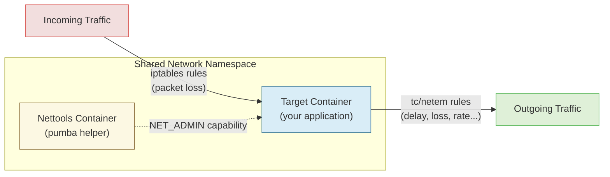

# Network Chaos Testing

Pumba provides two complementary tools for network chaos testing:

- **netem** - Manipulates _outgoing_ traffic using Linux `tc` (traffic control): delay, packet loss, corruption, duplication, and rate limiting
- **iptables** - Manipulates _incoming_ traffic using Linux `iptables`: packet loss with random or nth-packet matching

By combining both, you can create realistic asymmetric network conditions. For container chaos commands (kill, stop, pause, etc.), see the [User Guide](guide.md).

## How It Works

Pumba injects network chaos by creating a helper container that shares the target container's network namespace. This helper container runs `tc` or `iptables` commands to manipulate traffic without modifying the target container itself.



The helper container is created with the `NET_ADMIN` capability and attached to the target's network stack, so `tc` and `iptables` rules apply directly to the target's traffic.

## Network Tools Images

Pumba needs `tc` (from `iproute2`) and/or `iptables` to be available. You have two options:

1. Install `iproute2` and `iptables` packages inside the target container
2. Use the `--tc-image` or `--iptables-image` flags to specify a helper image (recommended)

### Recommended Images

| Image                                             | Base   | Includes      |
| ------------------------------------------------- | ------ | ------------- |
| `ghcr.io/alexei-led/pumba-alpine-nettools:latest` | Alpine | tc + iptables |
| `ghcr.io/alexei-led/pumba-debian-nettools:latest` | Debian | tc + iptables |

Both images are multi-architecture (`amd64` and `arm64`). Docker automatically pulls the correct image for your platform.

Since both images include tc _and_ iptables, you can use the same image for both `--tc-image` and `--iptables-image` flags.

### Building Network Tools Images

Build locally or push to a registry:

```bash
# Build single-arch images for local testing
make build-local-nettools

# Build multi-architecture images locally (doesn't push)
make build-nettools-images

# Build and push to GitHub Container Registry
make push-nettools-images
```

Pushing to GHCR requires authentication:

```bash
export GITHUB_USERNAME=your-github-username
export GITHUB_TOKEN=your-personal-access-token
echo $GITHUB_TOKEN | docker login ghcr.io -u $GITHUB_USERNAME --password-stdin
make push-nettools-images
```

## Netem Commands

Network emulation (`netem`) manipulates **outgoing** traffic using Linux traffic control (`tc`). All netem commands require a `--duration` flag and support these common options:

| Flag                            | Description                                            | Default                                           |
| ------------------------------- | ------------------------------------------------------ | ------------------------------------------------- |
| `--duration`, `-d`              | Emulation duration (must be shorter than `--interval`) | required                                          |
| `--interface`, `-i`             | Network interface to apply rules on                    | `eth0`                                            |
| `--target`, `-t`                | Target IP filter (repeatable); supports CIDR notation  | all                                               |
| `--egress-port`, `egressPort`   | Egress (source) port filter (comma-separated)          | all                                               |
| `--ingress-port`, `ingressPort` | Ingress (destination) port filter (comma-separated)    | all                                               |
| `--tc-image`                    | Docker image with `tc` tool                            | `ghcr.io/alexei-led/pumba-alpine-nettools:latest` |
| `--pull-image`                  | Force pull the tc-image                                | `true`                                            |

Run `pumba netem --help` for the full list of options.

### delay

Add latency to outgoing packets.

```bash
# Add 3 seconds delay to mydb for 5 minutes
pumba netem --duration 5m delay --time 3000 mydb

# Add 3000ms ± 30ms delay with 20% correlation on eth1
pumba netem --duration 5m --interface eth1 delay \
    --time 3000 --jitter 30 --correlation 20 "re2:^test"

# Normal distribution delay on a random container
pumba --random netem --duration 5m \
    delay --time 3000 --jitter 40 --distribution normal \
    container1 container2 container3
```

Options: `--time` (ms), `--jitter` (ms), `--correlation` (%), `--distribution` (uniform|normal|pareto|paretonormal).

### loss

Drop outgoing packets based on independent (Bernoulli) probability.

```bash
# Drop 5% of outgoing packets from mydb for 5 minutes
pumba netem --duration 5m loss --percent 5 mydb
```

Options: `--percent` (0-100), `--correlation` (%).

### loss-state

Drop outgoing packets based on a 4-state Markov model, useful for simulating bursty loss patterns.

The four states are:

1. Packet received successfully
2. Packet received within a burst
3. Packet lost within a burst
4. Isolated packet lost within a gap

```bash
# Simulate bursty packet loss
pumba netem --duration 5m loss-state --p13 5 --p31 90 mydb
```

Options: `--p13`, `--p31`, `--p32`, `--p23`, `--p14` (transition probabilities between states).

See: [Burst Loss Models](http://www.voiptroubleshooter.com/indepth/burstloss.html)

### loss-gemodel

Drop outgoing packets using the Gilbert-Elliot loss model, which models a channel alternating between "good" and "bad" states.

```bash
pumba netem --duration 5m loss-gemodel --pg 5 --pb 90 mydb
```

Options: `--pg` (transition probability into the bad state), `--pb` (transition probability into the good state), `--one-h` (loss probability in bad state), `--one-k` (loss probability in good state).

### duplicate

Duplicate outgoing packets based on independent probability.

```bash
pumba netem --duration 5m duplicate --percent 10 mydb
```

Options: `--percent` (0-100), `--correlation` (%).

### corrupt

Corrupt outgoing packets based on independent probability.

```bash
# Corrupt 10% of outgoing packets from mydb for 5 minutes
pumba netem --duration 5m corrupt --percent 10 mydb
```

Options: `--percent` (0-100), `--correlation` (%).

### rate

Limit outgoing bandwidth.

```bash
# Limit egress to 100kbit for mydb
pumba netem --duration 5m rate --rate 100kbit mydb

# Limit to 1mbit with packet overhead
pumba netem --duration 10m rate --rate 1mbit --packetoverhead 20 mydb
```

Options: `--rate` (e.g., `100kbit`, `1mbit`), `--packetoverhead` (bytes), `--cellsize` (bytes), `--celloverhead` (bytes).

## IPTables Commands

The `iptables` command manipulates **incoming** traffic by adding packet filtering rules. All iptables commands support these common options:

| Flag                      | Description                               | Default                                           |
| ------------------------- | ----------------------------------------- | ------------------------------------------------- |
| `--duration`, `-d`        | Emulation duration                        | required                                          |
| `--interface`, `-i`       | Network interface                         | `eth0`                                            |
| `--protocol`, `-p`        | Protocol filter (any, tcp, udp, icmp)     | `any`                                             |
| `--source`, `--src`       | Source IP filter (supports CIDR)          | all                                               |
| `--destination`, `--dest` | Destination IP filter (supports CIDR)     | all                                               |
| `--src-port`, `--sport`   | Source port filter (comma-separated)      | all                                               |
| `--dst-port`, `--dport`   | Destination port filter (comma-separated) | all                                               |
| `--iptables-image`        | Docker image with `iptables` tool         | `ghcr.io/alexei-led/pumba-alpine-nettools:latest` |
| `--pull-image`            | Force pull the image                      | `true`                                            |

Run `pumba iptables --help` for the full list of options.

### loss

Drop incoming packets using either random probability or every-nth-packet matching.

#### Random mode (default)

```bash
# Drop 20% of incoming packets for 5 minutes
pumba iptables --duration 5m loss --probability 0.2 web

# Drop 15% of incoming ICMP packets for 5 minutes
pumba iptables --duration 5m --protocol icmp loss --probability 0.15 "re2:database"
```

#### Nth mode

```bash
# Drop every 5th packet from a specific source on port 8080 for 5 minutes
pumba iptables --duration 5m --protocol tcp --source 192.168.1.100 --dst-port 8080 \
    loss --mode nth --every 5 api
```

#### Complex filtering

```bash
# Drop 25% of TCP traffic to port 443 from a specific subnet, for 30 seconds
pumba iptables --duration 30s --protocol tcp --source 10.0.0.0/24 --dst-port 443 \
    loss --probability 0.25 mycontainer
```

Options: `--mode` (random|nth), `--probability` (0.0-1.0), `--every` (nth mode), `--packet` (nth initial counter).

## Advanced Scenarios

Combining netem (outgoing) and iptables (incoming) creates realistic network conditions. Run commands concurrently using `&` in your shell.

### Asymmetric Network Conditions

Simulate different upload and download quality:

```bash
# Slow uploads: 500ms delay on outgoing traffic
pumba netem --tc-image ghcr.io/alexei-led/pumba-alpine-nettools:latest \
    --duration 5m delay --time 500 --jitter 50 myapp &

# Unreliable downloads: 10% loss on incoming traffic
pumba iptables --iptables-image ghcr.io/alexei-led/pumba-alpine-nettools:latest \
    --duration 5m loss --probability 0.1 myapp &
```

### Combined Network Degradation

Test bandwidth limits combined with packet loss:

```bash
# Limit outgoing bandwidth to 1Mbit/s
pumba netem --tc-image ghcr.io/alexei-led/pumba-alpine-nettools:latest \
    --duration 10m rate --rate 1mbit myapp &

# 5% loss on incoming traffic
pumba iptables --iptables-image ghcr.io/alexei-led/pumba-alpine-nettools:latest \
    --duration 10m loss --probability 0.05 myapp &
```

### Protocol-Specific Degradation

Target specific protocols differently:

```bash
# Add latency to all outgoing traffic
pumba netem --tc-image ghcr.io/alexei-led/pumba-alpine-nettools:latest \
    --duration 15m delay --time 200 myapp &

# Drop 20% of incoming UDP packets only
pumba iptables --iptables-image ghcr.io/alexei-led/pumba-alpine-nettools:latest \
    --duration 15m --protocol udp loss --probability 0.2 myapp &
```

### Microservices Resilience

Test how services handle degraded inter-service communication:

```bash
# High latency between service-a and service-b
pumba netem --tc-image ghcr.io/alexei-led/pumba-alpine-nettools:latest \
    --target service-b-ip --duration 10m \
    delay --time 1000 --jitter 200 service-a &

# Packet loss from service-c to service-b
pumba iptables --iptables-image ghcr.io/alexei-led/pumba-alpine-nettools:latest \
    --source service-c-ip --duration 10m \
    loss --probability 0.15 service-b &
```

### Port-Specific Degradation

Target specific service ports:

```bash
# Corrupt outgoing database traffic (port 5432)
pumba netem --tc-image ghcr.io/alexei-led/pumba-alpine-nettools:latest \
    --target db-server-ip --egress-port 5432 --duration 5m \
    corrupt --percent 5 myapp &

# Drop 10% of incoming HTTP traffic (port 80)
pumba iptables --iptables-image ghcr.io/alexei-led/pumba-alpine-nettools:latest \
    --dst-port 80 --duration 5m \
    loss --probability 0.1 myapp &
```

## Best Practices

- Use the same nettools image for both `--tc-image` and `--iptables-image` for consistency
- Always set `--duration` so chaos stops automatically
- Start with simple scenarios and increase complexity gradually
- Monitor your application during chaos tests to understand failure modes
- Avoid overlapping or conflicting rules on the same container
- Use `--dry-run` to verify targeting before running destructive tests

## Troubleshooting

- Verify the target container is running before starting chaos
- Ensure the nettools image is accessible (try `docker pull` manually)
- Check that you have permissions to create containers with `NET_ADMIN` capability
- On minikube, `pumba netem` commands won't work because the `sch_netem` kernel module is missing
- When using Kubernetes, ensure Pumba's service account has sufficient RBAC permissions

## Further Reading

- [User Guide](guide.md) - Container chaos commands and general usage
- [Stress Testing](stress-testing.md) - CPU, memory, and I/O stress
- [Deployment](deployment.md) - Docker, Kubernetes, and OpenShift
- [Example script](../examples/pumba_combined.sh) - Complete combined chaos testing script
