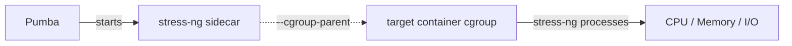
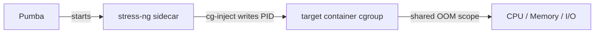

# Stress Testing

Pumba can stress-test container resources (CPU, memory, I/O) by running a sidecar container with [stress-ng](https://github.com/ColinIanKing/stress-ng) and placing it in the target container's cgroup hierarchy. For container chaos commands, see the [User Guide](guide.md). For network chaos, see [Network Chaos](network-chaos.md).

## How It Works

Pumba offers two modes for cgroup placement:

- **Default mode** uses Docker's `--cgroup-parent` to place the stress-ng sidecar relative to the target container. With the **cgroupfs** driver, this creates a child cgroup under the target, so stress-ng shares the target's resource limits. With the **systemd** driver, Docker cannot nest under another container's scope, so stress-ng is placed as a sibling in `system.slice` — it does **not** inherit the target's resource limits.
- **Inject-cgroup mode** (`--inject-cgroup`) uses the `cg-inject` binary to write the stress-ng PID directly into the target's `cgroup.procs`, placing stress-ng in the exact same cgroup regardless of driver. See [Same-Cgroup Injection Mode](#same-cgroup-injection-mode).



This approach works with both **cgroups v1** and **cgroups v2**, and supports all Docker cgroup drivers (cgroupfs, systemd).

> **Note:** For target-scoped stress on systemd-based Docker hosts, use `--inject-cgroup` mode. The default mode with the systemd driver places the sidecar as a sibling cgroup, not under the target's limits.

## Usage

```bash
pumba stress [options] CONTAINERS
```

Run `pumba stress --help` for the full list of options.

### Options

| Flag              | Default                               | Description                                                                                                                                 |
| ----------------- | ------------------------------------- | ------------------------------------------------------------------------------------------------------------------------------------------- |
| `--duration, -d`  | _(required)_                          | Stress duration; use unit suffix: `ms/s/m/h`                                                                                                |
| `--stress-image`  | `ghcr.io/alexei-led/stress-ng:latest` | Docker image with stress-ng tool                                                                                                            |
| `--pull-image`    | `true`                                | Pull the stress image from the registry before use                                                                                          |
| `--stressors`     | `--cpu 4 --timeout 60s`               | stress-ng stressors (see [stress-ng docs](https://github.com/ColinIanKing/stress-ng))                                                       |
| `--inject-cgroup` | `false`                               | Inject stress-ng into target container's cgroup (shared resource accounting). See [Same-Cgroup Injection Mode](#same-cgroup-injection-mode) |

> **Note:** The `--stressors` flag requires an `=` sign when passing values, e.g. `--stressors="--cpu 4 --timeout 60s"`.

## Examples

### CPU Stress

Stress 4 CPU workers for 60 seconds on a container named `myapp`:

```bash
pumba stress --duration 60s \
    --stressors="--cpu 4 --timeout 60s" \
    myapp
```

### Memory Stress

Stress 2 memory workers, each allocating 256MB, for 2 minutes:

```bash
pumba stress --duration 2m \
    --stressors="--vm 2 --vm-bytes 256M --timeout 120s" \
    myapp
```

### I/O Stress

Stress 4 I/O workers for 30 seconds:

```bash
pumba stress --duration 30s \
    --stressors="--io 4 --timeout 30s" \
    myapp
```

### Combined Stress

Stress CPU and memory simultaneously for 5 minutes:

```bash
pumba stress --duration 5m \
    --stressors="--cpu 2 --vm 1 --vm-bytes 128M --timeout 300s" \
    myapp
```

### Recurring Stress

Run stress tests every 10 minutes against a random container matching a regex:

```bash
pumba --interval 10m --random stress --duration 60s \
    --stressors="--cpu 2 --timeout 60s" \
    "re2:^api"
```

### Multiple Containers

Stress all containers with names starting with `worker`:

```bash
pumba stress --duration 30s \
    --stressors="--cpu 2 --timeout 30s" \
    "re2:^worker"
```

## stress-ng Image Requirements

Pumba uses [`ghcr.io/alexei-led/stress-ng:latest`](https://github.com/alexei-led/stress-ng/pkgs/container/stress-ng) by default. This is a minimal `scratch` image containing only the statically linked `stress-ng` binary.

If you provide a custom image with `--stress-image`, it must have the `stress-ng` binary at `/stress-ng` (absolute path). No shell, Docker CLI, or cgroup tools are required.

## Same-Cgroup Injection Mode

By default, Pumba places the stress-ng sidecar using Docker's `--cgroup-parent`. With the **cgroupfs** driver, this creates a child cgroup under the target — if stress-ng triggers an OOM kill, only the sidecar is terminated. With the **systemd** driver, the sidecar is placed as a sibling in `system.slice` and does not share the target's resource limits (see note above).

The `--inject-cgroup` flag enables **same-cgroup injection**, which places stress-ng processes directly into the target container's cgroup. This creates more realistic chaos because stress-ng shares the exact same resource accounting and OOM scope as the target.



### When to Use

- **Realistic resource contention**: stress-ng competes for the exact same CPU/memory limits as the target
- **OOM testing**: trigger OOM kills that affect both the target and stress-ng (shared OOM scope)
- **Accurate cgroup accounting**: stress-ng resource usage is attributed to the target container in monitoring tools

### Usage

```bash
pumba stress --inject-cgroup --duration 60s \
    --stressors="--cpu 4 --timeout 60s" \
    --stress-image myregistry/pumba-stress:latest \
    mycontainer
```

### Image Requirements

The `--inject-cgroup` mode requires a stress image containing both:

- `/cg-inject` — a minimal binary that writes its PID into the target's cgroup
- `/stress-ng` — the stress-ng binary

The repo includes `docker/stress.Dockerfile` which builds this combined image:

```bash
docker build -f docker/stress.Dockerfile -t myregistry/pumba-stress:latest .
docker push myregistry/pumba-stress:latest
```

### Security

- **No privileged mode** required
- **No Linux capabilities** needed (`--cap-drop=ALL` works)
- The sidecar runs with `--cgroupns=host` to access the host cgroup hierarchy
- `/sys/fs/cgroup` is mounted read-write into the sidecar

### Child Cgroup vs Same-Cgroup Injection

| Aspect                  | Child Cgroup (default)                                            | Same-Cgroup (`--inject-cgroup`)                 |
| ----------------------- | ----------------------------------------------------------------- | ----------------------------------------------- |
| **Cgroup placement**    | Child of target (cgroupfs) or sibling in `system.slice` (systemd) | Same cgroup as target                           |
| **OOM behavior**        | OOM kills stress-ng only (cgroupfs); not target-scoped (systemd)  | Shared OOM risk — target may be killed          |
| **Resource accounting** | Shared with target (cgroupfs); independent (systemd)              | Combined with target                            |
| **Use case**            | Safe stress testing, CI/CD                                        | Realistic chaos, OOM testing                    |
| **Security**            | No caps, no special mounts                                        | No caps, needs `--cgroupns=host` + cgroup mount |
| **Flag**                | _(default)_                                                       | `--inject-cgroup`                               |

### Cgroups v1 and v2 Compatibility

Both modes work with **cgroups v1** and **cgroups v2**, and with both **cgroupfs** and **systemd** cgroup drivers. Pumba auto-detects the cgroup version and driver from the Docker daemon.

### Kubernetes Cgroup Path Resolution

On Kubernetes, containers are placed in cgroup hierarchies like `/kubepods/burstable/pod<uid>/<containerID>` rather than the standalone Docker paths (`/docker/<id>`). Pumba automatically resolves the correct cgroup path by inspecting the target container via the Docker API (`ContainerInspect`).

- **Default mode**: Pumba reads the target's `HostConfig.CgroupParent` and constructs the correct `--cgroup-parent` for the stress-ng sidecar, so it is placed under the same Kubernetes pod cgroup hierarchy.
- **Inject-cgroup mode**: Pumba passes the resolved cgroup path directly to `cg-inject` via its `--cgroup-path` flag, bypassing driver-based path construction entirely.

No manual configuration is needed — Pumba detects Kubernetes cgroup paths and standalone Docker paths transparently.

### cg-inject Path Construction

For `--inject-cgroup` mode, the `cg-inject` binary detects the cgroup version by checking for `/sys/fs/cgroup/cgroup.controllers` (present on v2, absent on v1) and constructs the appropriate cgroup path:

| Cgroup version | Driver   | Path format                                                      |
| -------------- | -------- | ---------------------------------------------------------------- |
| v2             | cgroupfs | `/sys/fs/cgroup/docker/<id>/cgroup.procs`                        |
| v2             | systemd  | `/sys/fs/cgroup/system.slice/docker-<id>.scope/cgroup.procs`     |
| v1             | cgroupfs | `/sys/fs/cgroup/cpu/docker/<id>/cgroup.procs`                    |
| v1             | systemd  | `/sys/fs/cgroup/cpu/system.slice/docker-<id>.scope/cgroup.procs` |

When Pumba passes `--cgroup-path` (as it does on Kubernetes), these driver-based paths are not used — `cg-inject` writes directly to the provided path.

## Tips

- The `--timeout` value in `--stressors` should match or be less than `--duration`
- Use `--dry-run` to verify which containers would be targeted without actually running stress tests
- Combine with `--label` to target containers by Kubernetes labels (e.g., `--label io.kubernetes.pod.namespace=staging`)
- stress-ng supports many stressor types beyond CPU, memory, and I/O; see the [full stress-ng documentation](https://github.com/ColinIanKing/stress-ng) for all options

## Further Reading

- [User Guide](guide.md) - Container chaos commands and general usage
- [Network Chaos](network-chaos.md) - netem and iptables commands
- [Deployment](deployment.md) - Docker, Kubernetes, and OpenShift
- [Contributing](../CONTRIBUTING.md) - Building and contributing to Pumba
