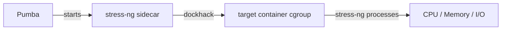

# Stress Testing

Pumba can stress-test container resources (CPU, memory, I/O) by injecting the [stress-ng](https://kernel.ubuntu.com/~cking/stress-ng/) tool into a target container's cgroup. For container chaos commands, see the [User Guide](guide.md). For network chaos, see [Network Chaos](network-chaos.md).

## How It Works

Pumba runs a sidecar container with `stress-ng` and injects it into the target container's cgroup using the [`dockhack`](https://github.com/tavisrudd/dockhack) helper script. This means `stress-ng` processes consume the target container's resource limits, not host resources.



## Usage

```bash
pumba stress [options] CONTAINERS
```

Run `pumba stress --help` for the full list of options.

### Options

| Flag             | Default                             | Description                                                                             |
| ---------------- | ----------------------------------- | --------------------------------------------------------------------------------------- |
| `--duration, -d` | _(required)_                        | Stress duration; use unit suffix: `ms/s/m/h`                                            |
| `--stress-image` | `alexeiled/stress-ng:latest-ubuntu` | Docker image with stress-ng and required tools                                          |
| `--pull-image`   | `true`                              | Pull the stress image from the registry before use                                      |
| `--stressors`    | `--cpu 4 --timeout 60s`             | stress-ng stressors (see [stress-ng docs](https://kernel.ubuntu.com/~cking/stress-ng/)) |

> **Note:** The `--stressors` flag requires an `=` sign when passing values, e.g. `--stressors="--cpu 4 --timeout 60s"`.

## Examples

### CPU Stress

Stress 4 CPU workers for 60 seconds on a container named `myapp`:

```bash
pumba stress --duration 60s \
    --stressors="--cpu 4 --timeout 60s" \
    myapp
```

### Memory Stress

Stress 2 memory workers, each allocating 256MB, for 2 minutes:

```bash
pumba stress --duration 2m \
    --stressors="--vm 2 --vm-bytes 256M --timeout 120s" \
    myapp
```

### I/O Stress

Stress 4 I/O workers for 30 seconds:

```bash
pumba stress --duration 30s \
    --stressors="--io 4 --timeout 30s" \
    myapp
```

### Combined Stress

Stress CPU and memory simultaneously for 5 minutes:

```bash
pumba stress --duration 5m \
    --stressors="--cpu 2 --vm 1 --vm-bytes 128M --timeout 300s" \
    myapp
```

### Recurring Stress

Run stress tests every 10 minutes against a random container matching a regex:

```bash
pumba --interval 10m --random stress --duration 60s \
    --stressors="--cpu 2 --timeout 60s" \
    "re2:^api"
```

### Multiple Containers

Stress all containers with names starting with `worker`:

```bash
pumba stress --duration 30s \
    --stressors="--cpu 2 --timeout 30s" \
    "re2:^worker"
```

## stress-ng Image Requirements

Pumba uses [`alexeiled/stress-ng:latest-ubuntu`](https://hub.docker.com/r/alexeiled/stress-ng/) by default, an Ubuntu-based image with a statically linked `stress-ng` binary.

You can provide a custom image with `--stress-image`, but it must include:

1. `stress-ng` tool (in `$PATH`)
2. Bash shell
3. [`dockhack`](https://github.com/tavisrudd/dockhack) helper Bash script (in `$PATH`)
4. `docker` client CLI tool (runnable without `sudo`)
5. `cgexec` tool, from `cgroups-tools` or `cgroup-bin` packages

### Building a Custom Stress Image

A minimal Dockerfile for a custom stress image:

```dockerfile
FROM ubuntu:22.04

RUN apt-get update && apt-get install -y \
    stress-ng \
    cgroup-tools \
    docker.io \
    bash \
    curl \
    && rm -rf /var/lib/apt/lists/*

# Install dockhack
RUN curl -sSL https://raw.githubusercontent.com/tavisrudd/dockhack/master/dockhack -o /usr/local/bin/dockhack \
    && chmod +x /usr/local/bin/dockhack
```

## Tips

- The `--timeout` value in `--stressors` should match or be less than `--duration`
- Use `--dry-run` to verify which containers would be targeted without actually running stress tests
- Combine with `--label` to target containers by Kubernetes labels (e.g., `--label io.kubernetes.pod.namespace=staging`)
- stress-ng supports many stressor types beyond CPU, memory, and I/O; see the [full stress-ng documentation](https://kernel.ubuntu.com/~cking/stress-ng/) for all options
