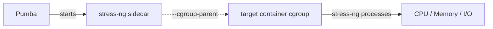

# Stress Testing

Pumba can stress-test container resources (CPU, memory, I/O) by injecting the [stress-ng](https://github.com/ColinIanKing/stress-ng) tool into a target container's cgroup. For container chaos commands, see the [User Guide](guide.md). For network chaos, see [Network Chaos](network-chaos.md).

## How It Works

Pumba runs a sidecar container with `stress-ng` and places it in the same cgroup as the target container (using Docker's `--cgroup-parent` feature). This means `stress-ng` processes share the resource limits (CPU quotas, memory limits) of the target container.



This approach works with both **cgroups v1** and **cgroups v2**, and supports all Docker cgroup drivers (cgroupfs, systemd).

## Usage

```bash
pumba stress [options] CONTAINERS
```

Run `pumba stress --help` for the full list of options.

### Options

| Flag             | Default                               | Description                                                                           |
| ---------------- | ------------------------------------- | ------------------------------------------------------------------------------------- |
| `--duration, -d` | _(required)_                          | Stress duration; use unit suffix: `ms/s/m/h`                                          |
| `--stress-image` | `ghcr.io/alexei-led/stress-ng:latest` | Docker image with stress-ng tool                                                      |
| `--pull-image`   | `true`                                | Pull the stress image from the registry before use                                    |
| `--stressors`    | `--cpu 4 --timeout 60s`               | stress-ng stressors (see [stress-ng docs](https://github.com/ColinIanKing/stress-ng)) |

> **Note:** The `--stressors` flag requires an `=` sign when passing values, e.g. `--stressors="--cpu 4 --timeout 60s"`.

## Examples

### CPU Stress

Stress 4 CPU workers for 60 seconds on a container named `myapp`:

```bash
pumba stress --duration 60s \
    --stressors="--cpu 4 --timeout 60s" \
    myapp
```

### Memory Stress

Stress 2 memory workers, each allocating 256MB, for 2 minutes:

```bash
pumba stress --duration 2m \
    --stressors="--vm 2 --vm-bytes 256M --timeout 120s" \
    myapp
```

### I/O Stress

Stress 4 I/O workers for 30 seconds:

```bash
pumba stress --duration 30s \
    --stressors="--io 4 --timeout 30s" \
    myapp
```

### Combined Stress

Stress CPU and memory simultaneously for 5 minutes:

```bash
pumba stress --duration 5m \
    --stressors="--cpu 2 --vm 1 --vm-bytes 128M --timeout 300s" \
    myapp
```

### Recurring Stress

Run stress tests every 10 minutes against a random container matching a regex:

```bash
pumba --interval 10m --random stress --duration 60s \
    --stressors="--cpu 2 --timeout 60s" \
    "re2:^api"
```

### Multiple Containers

Stress all containers with names starting with `worker`:

```bash
pumba stress --duration 30s \
    --stressors="--cpu 2 --timeout 30s" \
    "re2:^worker"
```

## stress-ng Image Requirements

Pumba uses [`ghcr.io/alexei-led/stress-ng:latest`](https://github.com/alexei-led/stress-ng/pkgs/container/stress-ng) by default. This is a minimal `scratch` image containing only the statically linked `stress-ng` binary.

If you provide a custom image with `--stress-image`, it only needs to have the `stress-ng` binary in the `$PATH` (or as the entrypoint). No shell, Docker CLI, or cgroup tools are required.

## Tips

- The `--timeout` value in `--stressors` should match or be less than `--duration`
- Use `--dry-run` to verify which containers would be targeted without actually running stress tests
- Combine with `--label` to target containers by Kubernetes labels (e.g., `--label io.kubernetes.pod.namespace=staging`)
- stress-ng supports many stressor types beyond CPU, memory, and I/O; see the [full stress-ng documentation](https://github.com/ColinIanKing/stress-ng) for all options

## Further Reading

- [User Guide](guide.md) - Container chaos commands and general usage
- [Network Chaos](network-chaos.md) - netem and iptables commands
- [Deployment](deployment.md) - Docker, Kubernetes, and OpenShift
- [Contributing](../CONTRIBUTING.md) - Building and contributing to Pumba
